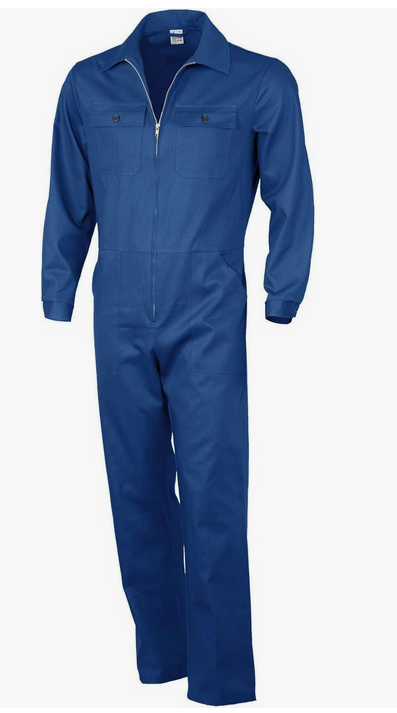
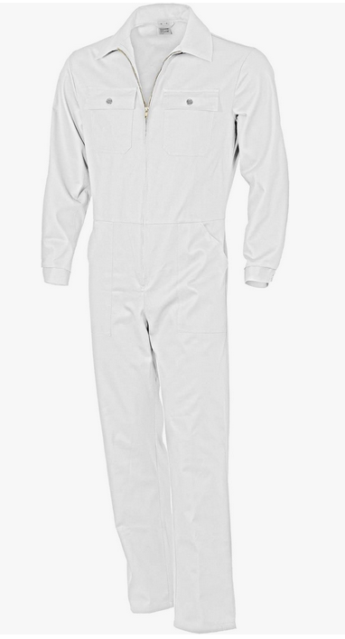
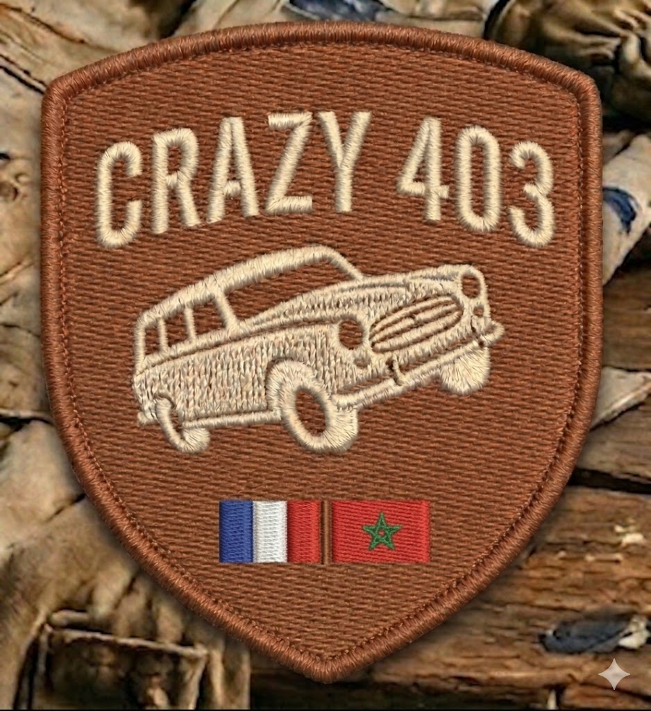

# Tenue pilote

Concept de tenue pilote pour le raid Crazy Dust 2027.

## Combinaison rallye

Modèle : **Qualitex Combinaison Rallye**

- [Voir sur Amazon](https://www.amazon.fr/Qualitex-Combinaison-Rallye-Plusieurs-couleurs/dp/B007MS9SUG)
- Coloris disponibles — **à choisir avec Zill**

|  |  |
|:---:|:---:|
| **Bleue** | **Blanche** |

## Écusson brodé

Écusson à faire broder au Maroc, à coudre sur la combinaison.

- Forme : blason
- Fond : camel/sahara
- Motif : 403 Break brodé beige
- Texte : "CRAZY 403"
- Drapeaux français + marocain

> Rendu IA — un fichier vectoriel (SVG/AI) sera nécessaire pour la broderie machine.
