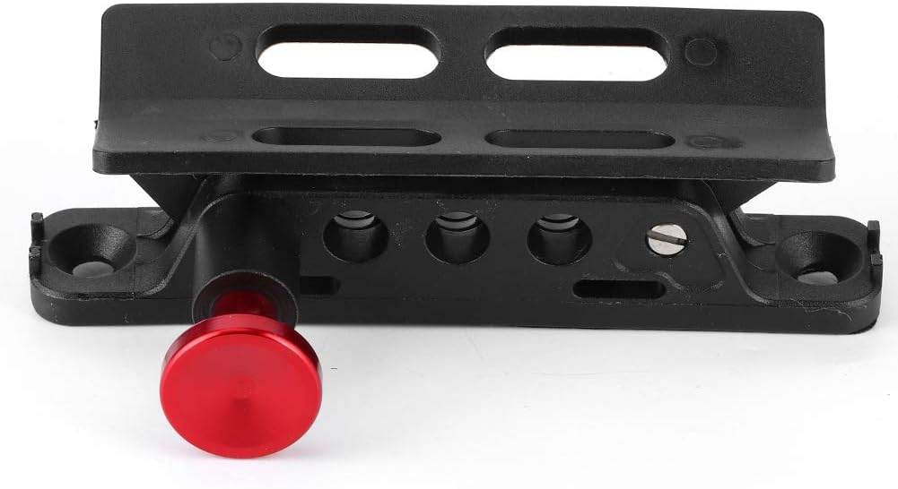
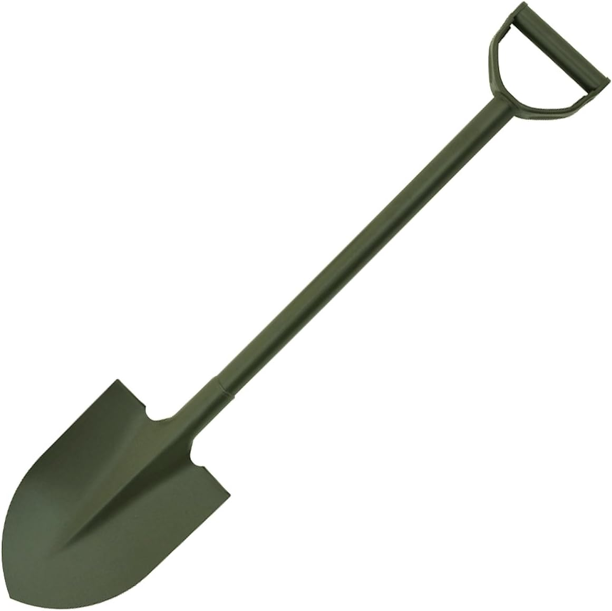
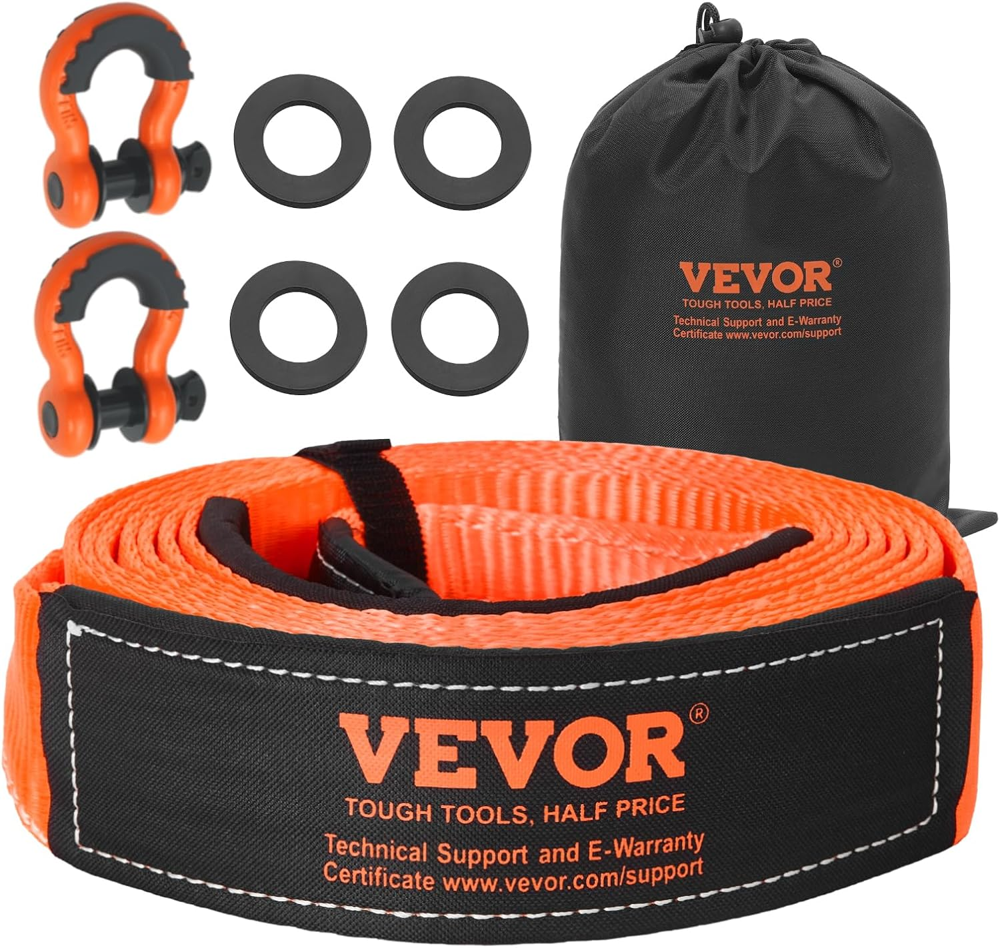
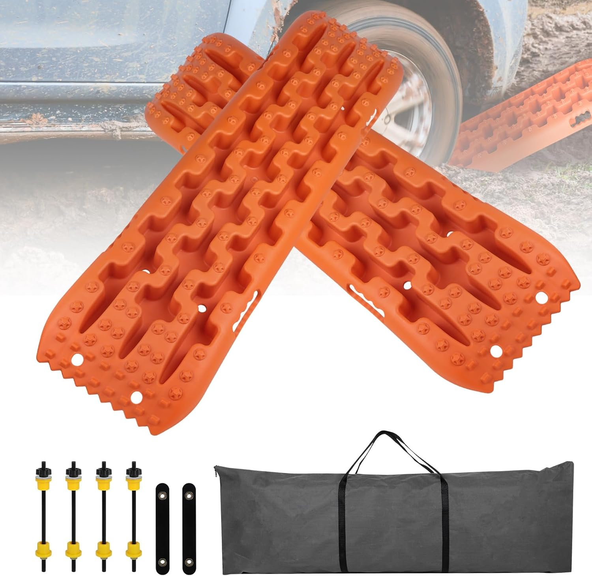
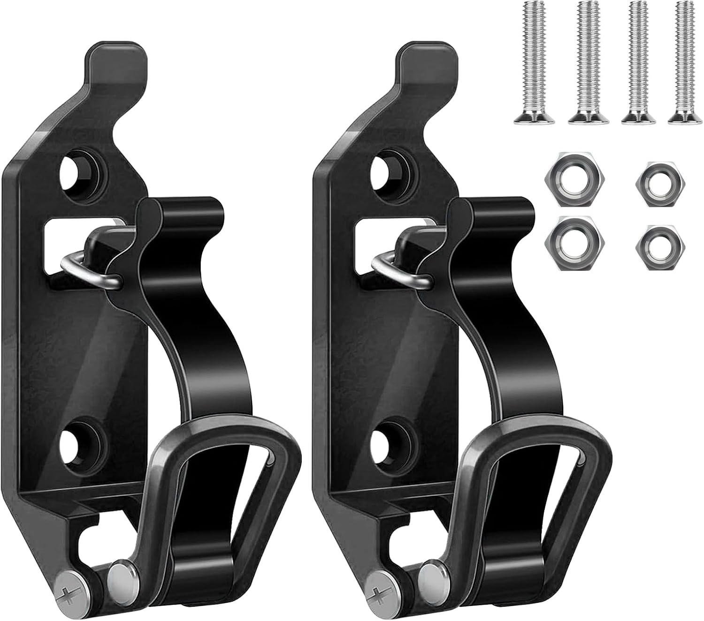

# Pièces à acheter/demander disponibilité avant départ Maroc

Pièces à acquérir ou à vérifier la disponibilité sur place avant le départ du véhicule vers le Maroc — par défaut en France, sauf celles potentiellement disponibles à l'atelier au Maroc (à confirmer avec l'atelier avant le départ).  
Géré via le skill `/todo` (code : `pieces`).

## À faire

### À acheter en France

- [ ] extincteur (obligatoire pour le raid)
- [ ] support rapide extincteur — fixation à dégagement rapide (type Jeep/JK), pour l'extincteur NOS DIY sur le tunnel de transmission — [Amazon](https://www.amazon.fr/gp/product/B0BYW5TZ6S/) — 28,89 €
  
- [ ] pelle de sable "type Jeep" — pelle acier pliante MFH Type I, coloris OD Green (kaki) — [Amazon](https://www.amazon.fr/gp/product/B06WVYMKC5/) — 19,75 €
  
- [ ] sangle cinétique de remorquage — VEVOR 76,2 mm × 6,1 m, résistance 36 000 lbs (~16 t), gaines de protection + 2 manilles D-ring 19 mm + sac — [Amazon](https://www.amazon.fr/gp/product/B0FG7QL486/)
  
- [ ] crochets de remorquage — à adapter/souder sur le véhicule à l'atelier Maroc — diamètre mini 24.5 mm (compatibles manilles VEVOR 3/4" déjà reçues)
- [x] support téléphone voiture magnétique Yianerm — ventouse aimant fort, bras télescopique réglable ✅ commandé 2026-07-24, livraison prévue 2026-07-27
- [x] platine USB encastrable (pour installation habitacle) — [Amazon - Thlevel chargeur USB + voltmètre + interrupteur](https://www.amazon.fr/Thlevel-Chargeur-Voltm%C3%A8tre-Num%C3%A9rique-Interrupteur/dp/B0CCHRS8T3) (prise allume-cigare intégrée) ✅ commandée 2026-07-24, livraison prévue 2026-07-29
- [x] clignotant AV manquant — paire de cabochons + platine + cerclage chromé — [LBC Mur-sur-Allier](https://www.leboncoin.fr/ad/equipement_auto/3187769939) ✅ commandés 2026-06-03, montés 2026-06-26
- [x] joints de feux arrière × 2 — réf. 6344 02 CE Serie04 ✅ commandés 2026-08-01 (en attente réception, Serie04 en congés)
- [x] 1 jante classique fourgonnette **avec fixation enjoliveur**, 5R15 Michelin — pour compléter le jeu de 4 jantes identiques (vendeur LBC) ✅ payée et expédiée 2026-06-01, jeux montés 2026-06-26
- [x] 4 pneus route provisoires (contrôle technique + roulage en attendant les pneus raid) — **Nankang Econex NA-1 165/80R15 87T** (tourisme été) — 57 €/pièce — [allopneus.com](https://www.allopneus.com/produit/pneu-auto/nankang/tourisme-ete/econex-na-1/165-80r15-87t/0004280184) ✅ commandés 2026-05-29, montés avec chambres à air 2026-06-26
- [x] 2 pneus tout terrain pour roues de secours — **General Grabber AT3 195/80R15** ✅ commandés 2026-05-29, montés avec chambres à air 2026-06-26
- [x] 4 pneus tout terrain raid (pour les 4 roues du véhicule) — **General Grabber AT3 195/80R15** ✅ commandés 2026-07-26
- ~~[ ] 1 bouton de poignée de porte arrière (manquant sur le véhicule acheté)~~ — trouvé par le vendeur ✅
- ~~[ ] 2 cabochons de feux arrière (manquants sur le véhicule acheté)~~ — trouvés par le vendeur ✅
- [x] rétroviseur côté conducteur — paire achetée sur eBay ✅ 2026-06-05, montés 2026-06-26
- [x] balais d'essuie-glace — trouvés et montés ✅ 2026-06-26
- [ ] phares LED style rétromod — [AliExpress](https://fr.aliexpress.com/item/1005004800260632.html) ✅ modèle retenu
  
- [ ] plaques de désensablage + supports — jeu de 2 plaques de traction (orange) avec supports de fixation galerie, sangles de maintien et sac de rangement — [Amazon](https://www.amazon.fr/gp/product/B0DCS71CLH/)
  
- [ ] support de pelle pour galerie de toit (lot de 2) — supports métal + caoutchouc pour barres de toit / galerie, fixation pelle ou outils, visserie fournie — [Amazon](https://www.amazon.fr/gp/product/B0DRCYJFHH/) — 12,99 €
  
- [ ] séparateur cyclonique (filtration air moteur)

- [x] durites radiateur supérieure + inférieure — Serie04 ✅ reçues + montées 2026-06-26
- [x] roulement de roue AV × 2 — Serie04 ✅ reçus + installés 2026-06-26
- [x] joints spi 38x62x10 × 2 — Serie04 ✅ reçus + installés 2026-06-26
- [x] joints de phare × 2 — Serie04 ✅ reçus 2026-06-26, montage au Maroc (après étape carrosserie, au remontage)
- [x] joints de feu avant × 2 — Serie04 (réf. 6304 09 CE) ✅ commandés et reçus
- [x] joint éclaireur plaque de police × 1 — Serie04 ✅ reçu 2026-06-26, montage au Maroc (après étape carrosserie, au remontage)

### Si disponible: achat au Maroc. sinon à acheter en France avant départ

- ~~[ ] capot supplémentaire~~ — snorkel non retenu ✅
- [ ] bavettes avant/arriere

### Stickers (à commander en France avant départ atelier)

- [ ] sticker boiserie (pour le fun)
- [ ] stickers vintage (selon dispo) — options repérées :
  - [Gulf](https://fr.aliexpress.com/item/1005003188255120.html)
  - [Peugeot 3D](https://fr.aliexpress.com/item/1005009490038151.html)
  - [Camel Trophy](https://fr.aliexpress.com/item/1005010415740821.html)
  - [Goodyear old school](https://fr.aliexpress.com/item/1005012214949306.html)
  - [Castrol old school](https://fr.aliexpress.com/item/1005005722643701.html)
  - [SEV Marchal](https://fr.aliexpress.com/item/1005011683286168.html)
  - [Danger — ne pas me dire comment conduire](https://fr.aliexpress.com/item/1005010227787606.html)
  - [NOS](https://fr.aliexpress.com/item/1005007096885772.html)
- [ ] stickers rallye officiels (drapeau, noms pilotes, groupe sanguin)
