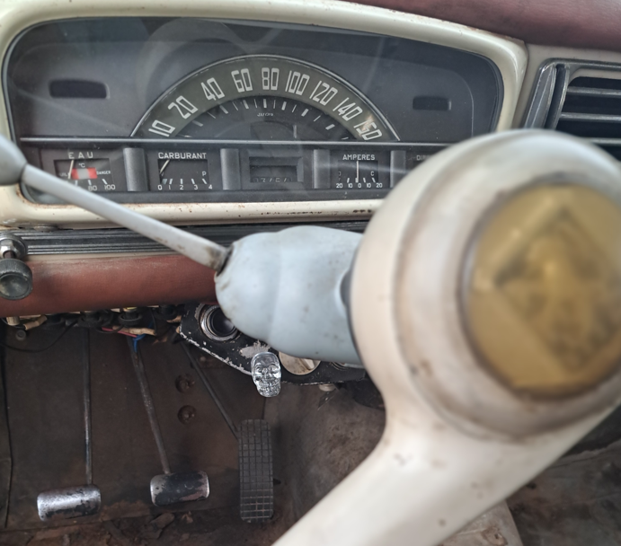
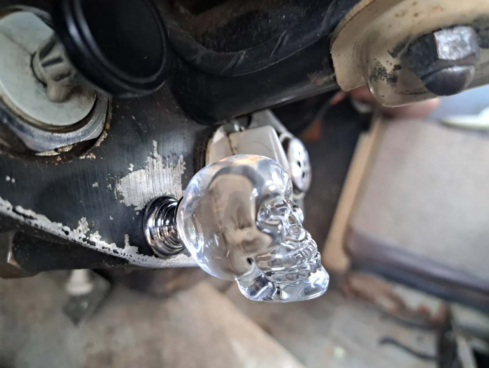

# Préparation export — Transport vers le Maroc

**Statut** : 🔧 En cours

---

## Journal

<!-- Les entrées sont ajoutées en haut du journal, du plus récent au plus ancien. -->

### 2026-07-29 — Réception pneus AT

Réception des 4 pneus AT (General Grabber AT3 195/80R15) pour le raid.

---

### 2026-07-26 — Commande plaques d'immatriculation

Commande passée. En attente du retour de chez Maillefauds pour envoi de la carte grise.

---

### 2026-07-26 — Tirette d'arrêt moteur — bouton personnalisé

Tirette d'arrêt moteur constatée et photographiée. Bouton personnalisé : tête de mort en verre (bouton de tiroir Amazon) — pas d'origine, mais du style.

---

### 2026-07-26 — Commande 4 pneus AT raid

4 × General Grabber AT3 195/80R15 commandés — pneus raid définitifs.
- Montant : 456 €
- Statut : commandé ⏳

---

### 2026-07-18 — Réception manilles de remorquage

2 manilles en D VEVOR 3/4" (19 mm) reçues ✅

---

### 2026-07-10 — Réception carte grise

Carte grise reçue. Commande des plaques d'immatriculation à faire.

---

### 2026-06-03
Clignotants AV commandés sur LeBonCoin : paire de cabochons + platine + cerclage chromé. Vendeur validé.

### 2026-05-26
Photos envoyées à l'atelier. En attente de réponse pour les dates et le devis.
