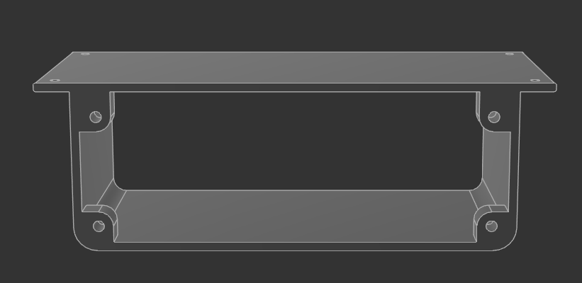

# Tâches avant départ Maroc

Tâches à effectuer en France avant le départ du véhicule vers le Maroc.  
Géré via le skill `/todo` (code : `export`).

## À faire

### Travaux à effectuer en France avant départ

- [x] Fabrication support pour platine USB ✅ — à tester

    
- [ ] Installation platine USB dans l'habitacle (avec fusible en amont)

### Logistique

- [ ] Prévoir frais transport véhicule (plan B si incapacité de ramener au domicile après achat)
- [ ] Contacter atelier Maroc — explication du projet
- [ ] Prendre rendez-vous avec l'atelier
- [ ] Fournir à l'atelier la liste des pièces recherchées
- [ ] Billets ferry — aller + retour libre
- [ ] Hébergement
