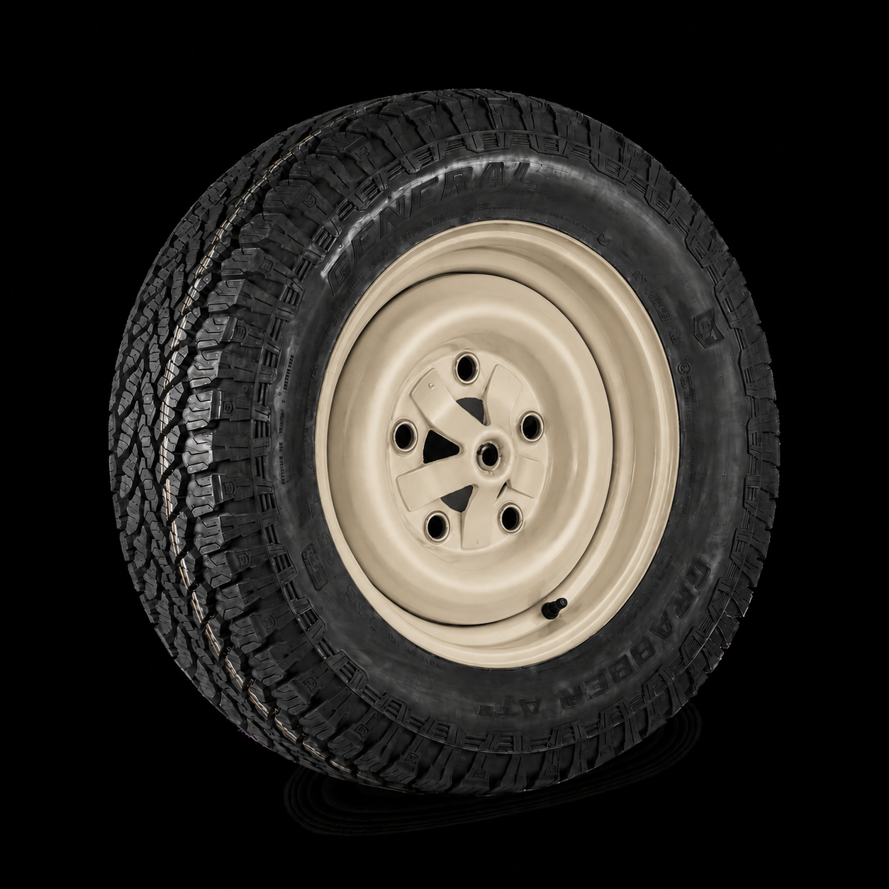
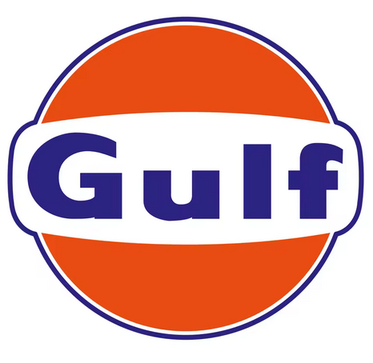
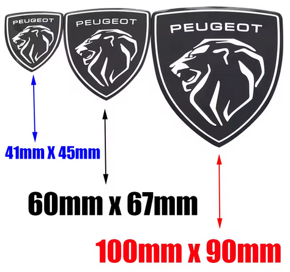
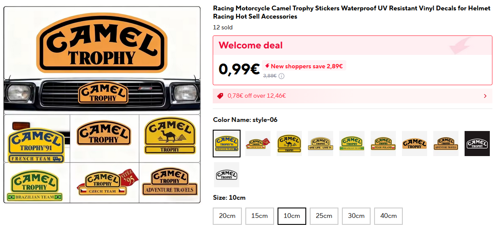
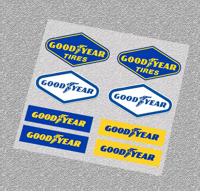
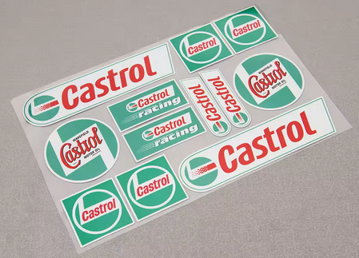
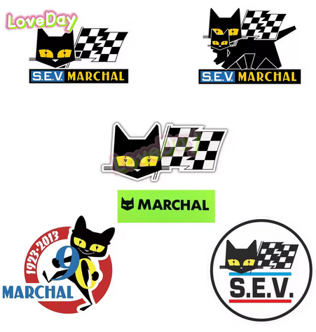
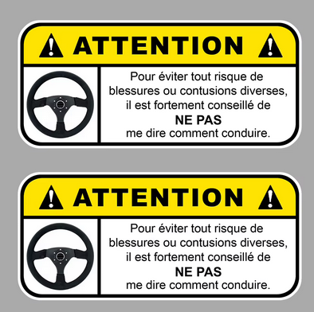
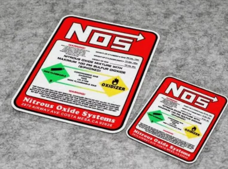
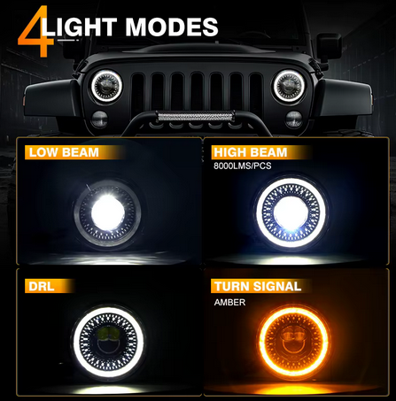

# Décoration, Gadgets & Accessoires — Préparation Raid

Idées, rendus et choix pour la décoration et les équipements du véhicule pour le Crazy Dust 2027.

Statuts : 💡 idée | ✅ retenu | ❌ écarté | 🛒 commandé/en cours

---

## Décoration

### Carrosserie & extérieur

*(à compléter)*

### Jantes

- ✅ **Jantes peintes époxy beige** — couleur assortie à la carrosserie

  
- 💡 **Enjoliveurs custom style cache-moyeux noirs** — à fabriquer, pour le raid

### Stickers & autocollants

- 🛒 [Gulf](https://fr.aliexpress.com/item/1005003188255120.html)
  
- 🛒 [Peugeot 3D](https://fr.aliexpress.com/item/1005009490038151.html)
  
- 🛒 [Camel Trophy](https://fr.aliexpress.com/item/1005010415740821.html) — plusieurs modèles dispo
  
- 🛒 [Goodyear old school](https://fr.aliexpress.com/item/1005012214949306.html)
  
- 🛒 [Castrol old school](https://fr.aliexpress.com/item/1005005722643701.html)
  
- 🛒 [SEV Marchal](https://fr.aliexpress.com/item/1005011683286168.html)
  
- 🛒 [Danger — ne pas me dire comment conduire](https://fr.aliexpress.com/item/1005010227787606.html)
  
- 🛒 [NOS](https://fr.aliexpress.com/item/1005007096885772.html)
  

### Déco intérieure

- [ ] **Dé de rétroviseur** — déco rétro
- [ ] **Chien à ressort** — tableau de bord
- 💡 **Volant style Mad Max** — idée non décidée, à l'étude

---

## Éclairage

- ✅ **Phares LED style rétromod** — [AliExpress](https://fr.aliexpress.com/item/1005004800260632.html)

  
- [ ] **Barre LED** — avec supports magnétiques pour toit
- [ ] **2 phares antibrouillard LED** — fixation sur pare-chocs

---

## Sono de toit

- [ ] **Klaxon trompettes** — 2x double trompettes (= 4 trompettes au total), montage sur barre sono de toit — [AliExpress](https://fr.aliexpress.com/item/1005006820945042.html)
- [ ] **Sirène + micro PTT** — montage sur barre sono de toit
- [ ] **2 haut-parleurs horn** — montage sur barre sono de toit
- [ ] **Ampli Bluetooth** — petit ampli pour alimenter les HP de la barre sono

---

## Tech & Instrumentation

### Pneumatique

- [ ] **Compresseur VEVOR YD-127-6L** — 12V, 6.35 CFM, 150 PSI, cuve 6L, 12.75 kg — pour alimenter les trompettes + gonflage pneus — montage zone milieu galerie (483×150×390 mm)
- [ ] **Raccord rapide** — pour soufflette et gonfleur
- [ ] **Tuyau pneumatique 3m**

### Instrumentation

- [ ] **TPMS** — capteurs de pression pneus, alimentation solaire + USB, avec inclinomètre / vitesse / boussole intégrés

---

## Autres

<!-- tout ce qui rentre pas dans les catégories ci-dessus -->
