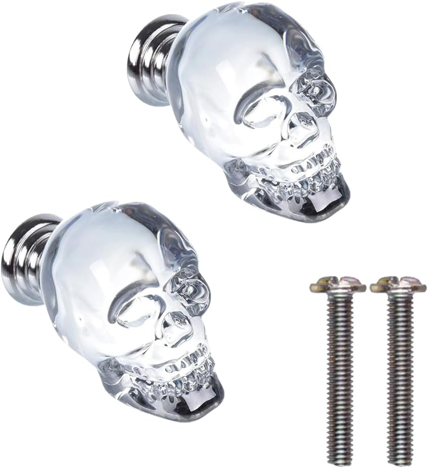
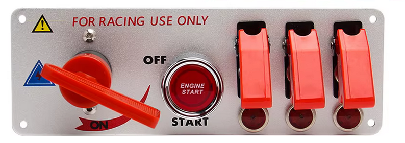
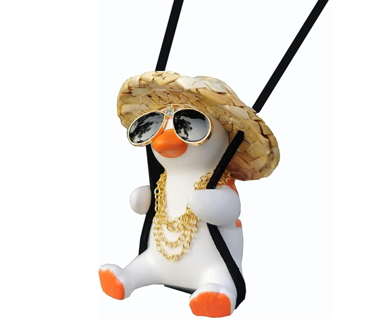
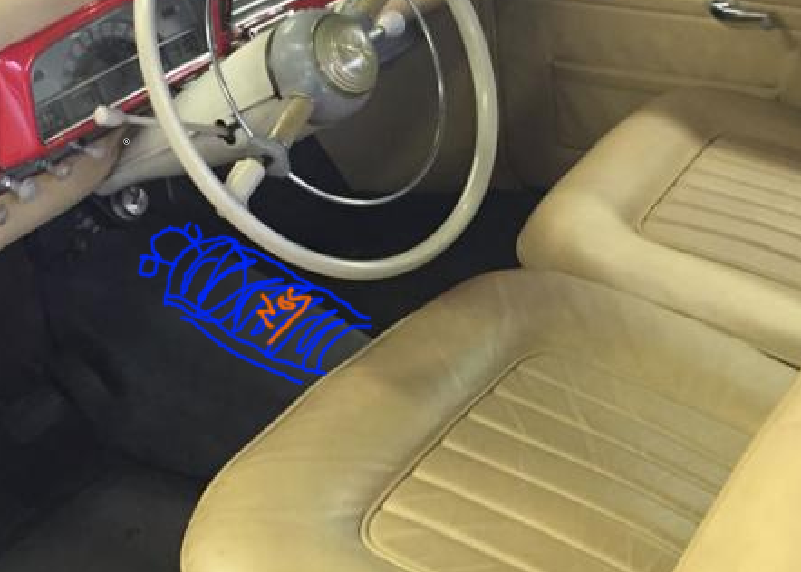
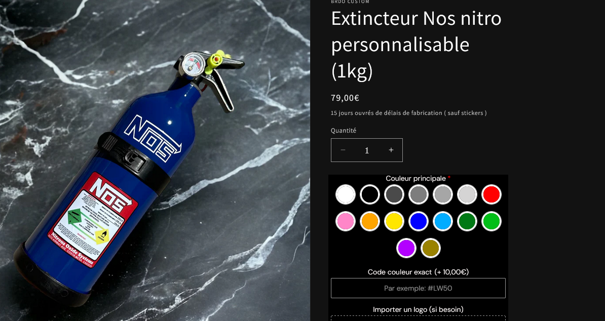

# Décoration, Gadgets & Accessoires — Préparation Raid

Idées, rendus et choix pour la décoration et les équipements du véhicule pour le Crazy Dust 2027.

Statuts : 💡 idée | ✅ retenu | ❌ écarté | 🛒 commandé/en cours

---

## Décoration

### Carrosserie & extérieur

*(à compléter)*

### Jantes

- ✅ **Jantes peintes époxy beige** — couleur assortie à la carrosserie
  { width="640" style="display:block" }
- 💡 **Enjoliveurs custom style cache-moyeux noirs** — à fabriquer, pour le raid

### Stickers & autocollants

- 🛒 [Gulf](https://fr.aliexpress.com/item/1005003188255120.html)
  { width="640" style="display:block" }
- 🛒 [Peugeot 3D](https://fr.aliexpress.com/item/1005009490038151.html)
  { width="640" style="display:block" }
- 🛒 [Camel Trophy](https://fr.aliexpress.com/item/1005010415740821.html) — plusieurs modèles dispo
  { width="640" style="display:block" }
- 🛒 [Goodyear old school](https://fr.aliexpress.com/item/1005012214949306.html)
  { width="640" style="display:block" }
- 🛒 [Castrol old school](https://fr.aliexpress.com/item/1005005722643701.html)
  { width="640" style="display:block" }
- 🛒 [SEV Marchal](https://fr.aliexpress.com/item/1005011683286168.html)
  { width="640" style="display:block" }
- 🛒 [Danger — ne pas me dire comment conduire](https://fr.aliexpress.com/item/1005010227787606.html)
  { width="640" style="display:block" }
- 🛒 [NOS](https://fr.aliexpress.com/item/1005007096885772.html)
  { width="640" style="display:block" }

### Déco intérieure

- 🛒 **Bouton tête de mort** — [Crystal Skull Decorative Drawer Knobs 2 Pack](https://www.amazon.fr/dp/B0CR4BL1QF) — pour la tirette d'arrêt moteur — 11,16 €
  { width="640" style="display:block" }
- 💡 **Panneau de switchs déco style course** — 3 switchs + 1 bouton start, ne servent à rien — [AliExpress](https://fr.aliexpress.com/item/1005006888977837.html)
  Libellés suggérés : **BOOST** / **WARP** / **EJECT** + bouton **START**
  { width="640" style="display:block" }
- 🛒 **Canard oscillant rétroviseur** — décoration suspendue rétroviseur — 12 € ✅ commandé 2026-07-26
  { width="640" style="display:block" }
- ~~💡 **Dé de rétroviseur** — déco rétro~~ — remplacé par le canard oscillant
- 💡 **Chien à ressort** — tableau de bord
- 💡 **Volant style Mad Max** — idée non décidée, à l'étude
- 💡 **Extincteur peint en bleu + sticker NOS** (DIY) — positionné sur le passage d'arbre (tunnel de transmission) — réf. produit existant pour inspiration : [Extincteur NOS Nitro personnalisable 1kg](http://tppt.eu/u/wouepT.png) ~79 €
  { width="640" style="display:block" }
  { width="640" style="display:block" }

---

## Éclairage

- ✅ **Phares LED style rétromod** — [AliExpress](https://fr.aliexpress.com/item/1005004800260632.html)
  { width="640" style="display:block" }
- 💡 **Barre LED** — avec supports magnétiques pour toit
- 💡 **2 phares antibrouillard LED** — fixation sur pare-chocs

---

## Sono de toit

- 💡 **Klaxon trompettes** — 2x double trompettes (= 4 trompettes au total), montage sur barre sono de toit — [AliExpress](https://fr.aliexpress.com/item/1005006820945042.html)
- 💡 **Sirène + micro PTT** — montage sur barre sono de toit
- 💡 **2 haut-parleurs horn** — montage sur barre sono de toit
- 💡 **Ampli Bluetooth** — petit ampli pour alimenter les HP de la barre sono

---

## Tech & Instrumentation

### Pneumatique

- 💡 **Compresseur VEVOR YD-127-6L** — 12V, 6.35 CFM, 150 PSI, cuve 6L, 12.75 kg — pour alimenter les trompettes + gonflage pneus — montage zone milieu galerie (483×150×390 mm)
- 💡 **Raccord rapide** — pour soufflette et gonfleur
- 💡 **Tuyau pneumatique 3m**

### Instrumentation

- 💡 **TPMS** — capteurs de pression pneus, alimentation solaire + USB, avec inclinomètre / vitesse / boussole intégrés

---

## Autres

<!-- tout ce qui rentre pas dans les catégories ci-dessus -->
