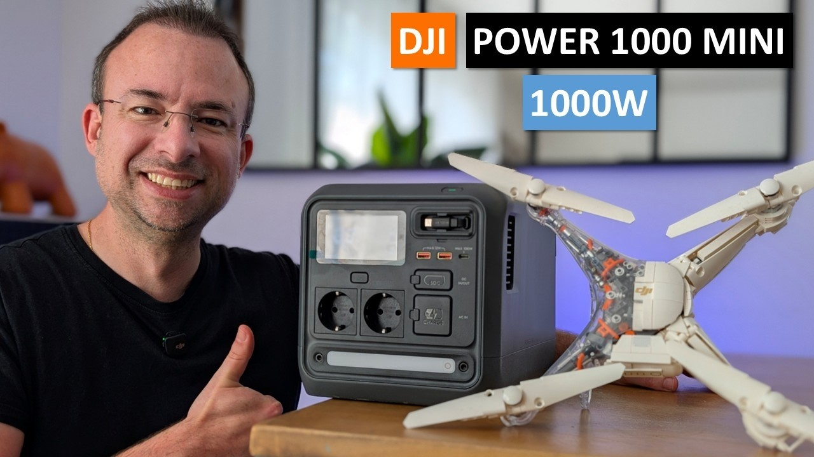

# DJI Power 1000 Mini — Fiche technique

**Source :** [dji.com/fr/power-1000-mini/specs](https://www.dji.com/fr/power-1000-mini/specs)  
**Dernière mise à jour :** 2026-05-25

---

## Présentation

Station d'énergie portable compacte de DJI — 1 kWh dans un format transportable.  
Pensée pour le camping, les road trips et la création de contenu.

> *"Compact for the journey, powerful with every charge."*

📺 **Vidéo de présentation :** [DJI Power 1000 Mini ❤️ 1 Kwh dans un format Mini](https://www.youtube.com/watch?v=ImgwWuIVvaA)

---

## Général

| Caractéristique | Valeur |
|---|---|
| Modèle | DYM1000M |
| Chimie cellulaire | **LFP** (lithium ferrophosphate) |
| Capacité | **1 008 Wh** |
| Durée de vie | >4 000 cycles à 80% de capacité résiduelle |
| Poids net | ~11,5 kg |
| Dimensions | 314 × 212 × 216 mm |
| Altitude max de fonctionnement | **5 000 m** |

---

## Ports disponibles

| Port | Nombre |
|---|---|
| Sortie CA (220V EU) | × 2 |
| USB-C | × 1 |
| Câble rétractable USB-C | × 1 |
| USB-A | × 2 |
| SDC (sortie/entrée 12V-28V) | × 1 |
| Entrée CA | × 1 |

---

## Sorties

| Port | Détail |
|---|---|
| **CA (220V)** | 1 000 W crête / 800 W continu |
| **USB-A** | 5V/2,4A — 12W max par canal |
| **USB-C** | 5/9/12/15/20V × 5A — **100W max** par canal |
| **SDC** | 9-28V — **300W max** |

> ℹ️ USB-C + câble rétractable simultanés : 150W total (100W câble + 50W port)

---

## Recharge (entrées)

| Source | Puissance max |
|---|---|
| **Secteur CA (220V)** | 800 W continu |
| **SDC (voiture / batterie)** | **400 W max** (9-28V) |
| **USB-C** | 100 W max |

> ✅ Recharge sur allume-cigare ou directement sur batterie véhicule en roulant — très pratique pour le raid

---

## Températures

| Usage | Plage |
|---|---|
| Alimentation | -10 à 45 °C |
| Recharge | -10 à 45 °C |
| Stockage | -10 à 45 °C |

---

## Connectivité

- Wi-Fi 802.11 b/g/n (2,4 GHz)
- Bluetooth 5.0

---

## Notes projet 403

- Chimie LFP : résistante à la chaleur et aux chocs — idéale pour le Maroc 🌡️
- Recharge SDC 400W : peut se recharger depuis la 403 en roulant
- 11,5 kg : transportable à la main
- 5 000 m d'altitude max : pas de souci dans le Haut-Atlas (~3 000 m max sur le parcours)
- Utilisation envisagée : alimentation matériel (drones, ordis, éclairage bivouac) + usage maison
