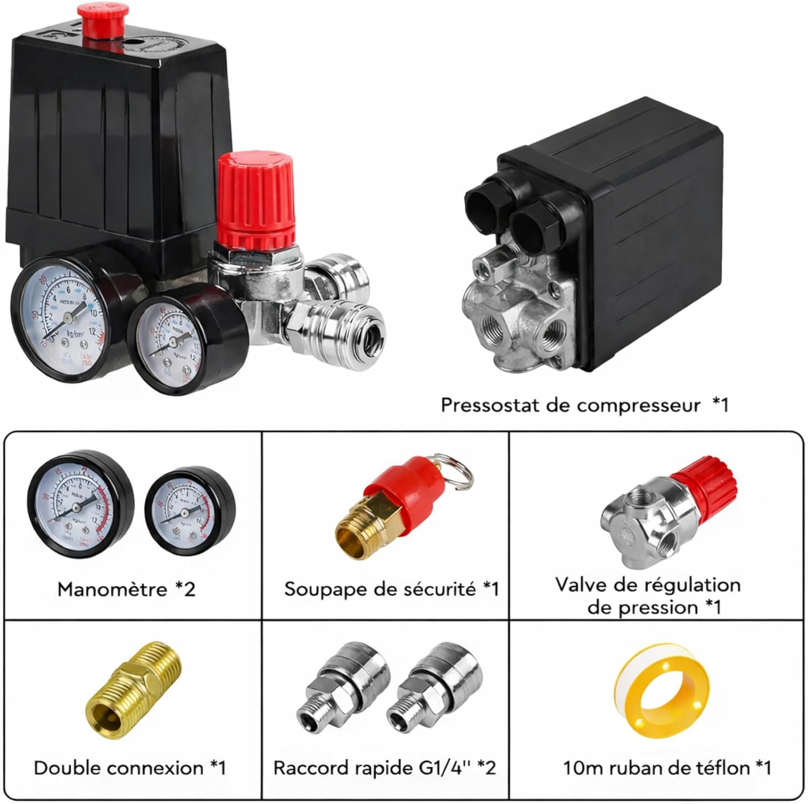
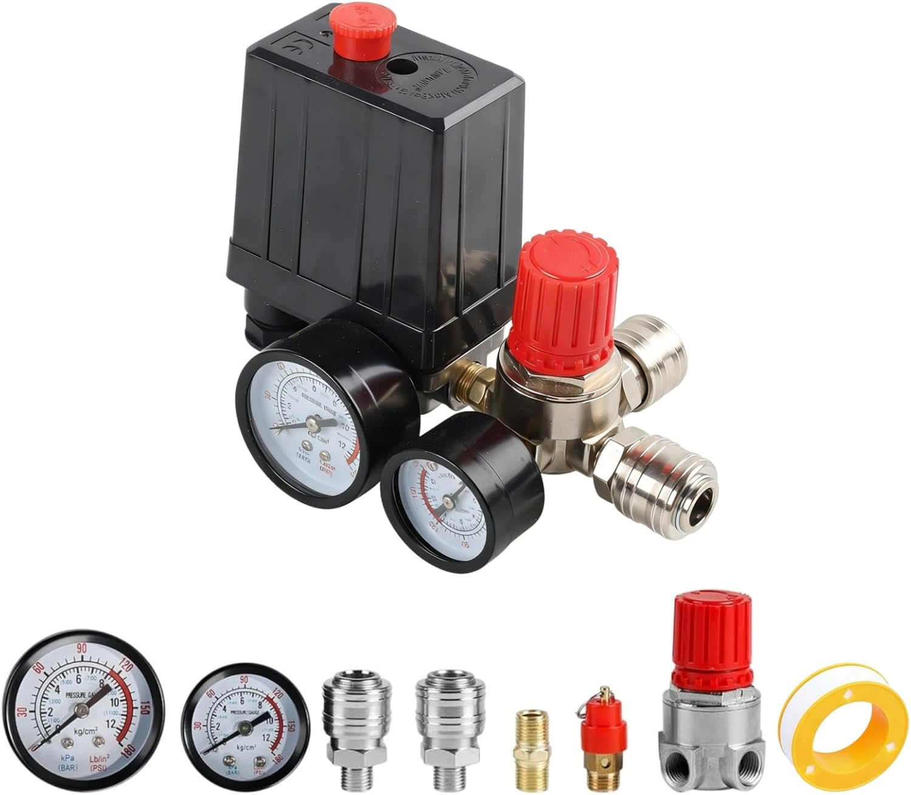

# Fiche technique — Compresseur 12V DIY

Conception d'un compresseur 12V avec cuve intégrée (extincteur recyclé), pour alimenter les trompettes et gonfler les pneus en autonomie sur le raid.

---

## Principe général

Compresseur du commerce (gonfleur 12V à pinces batterie, sans réservoir) couplé à une cuve de fabrication maison à base d'un extincteur recyclé. Ensemble monté sur le véhicule, piloté par pressostat.

---

## Composants

### Compresseur

- Gonfleur 12V avec pinces batterie, sans réservoir intégré
- Consommation max : ~20 A (≈ 200 W)
- *(référence à définir)*

### Cuve

- **Corps** : extincteur recyclé **3 à 6L** (eau/mousse ou poudre — éviter CO2)
- **Équipements montés sur la cuve :**
  - Soupape de sécurité (pression max)
  - Vanne de vidange — en partie basse (purge eau + dépressurisation)
  - Pressostat — coupe le compresseur quand la pression de consigne est atteinte, relance quand elle redescend
  - Manomètre

### Sorties (3 vannes)

| # | Usage | Raccord |
|---|---|---|
| 1 | Purge / vidange air directe | Vanne simple |
| 2 | Utilisation générale (gonflage pneus, soufflette…) | Raccord rapide européen standard |
| 3 | Réseau d'air trompettes | Régulateur de pression réglable + raccord tuyau PTFE pneumatique |

---

## Liste d'achats

### Kit pressostat — remplace plusieurs composants séparés

[KEUPOK — Kit pressostat compresseur](https://www.amazon.fr/dp/B0GVV9QKKT) — ~26 €

**Contenu du kit :**
- Pressostat avec ports intégrés (220V natif — contacts utilisés via relai 12V externe)
- 2 manomètres
- Soupape de sécurité
- Valve de régulation de pression (sortie trompettes)
- 2 raccords rapides G1/4"
- 10m ruban téflon

---

### Composants complémentaires

| # | Composant | Remarque / Référence | Prix indicatif |
|---|---|---|---|
| 1 | **Compresseur de base** | VIAIR 400P (150 PSI, 2.54 CFM, 12A) — référence overland | ~150-180 € |
| | *Alternative budget* | Gonfleur double cylindre 12V 150 PSI (AliExpress) | ~20-40 € |
| 2 | **Adaptateur tête extincteur** | M30×2 → 1/4" BSP (filetage à confirmer sur l'extincteur) | ~5-10 € |
| 3 | **Vanne de purge** | 1/4" BSP laiton (fond de cuve) | ~5 € |
| 4 | **Raccord push-in + tuyau PTFE** | 6mm, 1/4" BSP (réseau trompettes) | ~5-10 € + ~3-5 €/m |
| 5 | **Relai automobile 30A** | ISO mini — commandé par le pressostat | ~3-5 € |
| 6 | **Câble 4mm²** | Rouge + noir, ~2m chaque | ~5-8 € |
| 7 | **Porte-fusible + fusible 30A** | En ligne sur le + batterie | ~5 € |
| 8 | **Assortiment raccords 1/4" BSP** | Nipples, coudes, tés selon montage final | ~10-20 € |

**Total estimé** : ~220-270 € avec VIAIR / ~90-130 € avec compresseur budget

---

## Points à définir

- Volume de la cuve : extincteur 3 à 6L ✅ — contenance exacte à choisir selon encombrement
- Pression de consigne du pressostat (en bar)
- Pression max admissible de la cuve (à vérifier sur l'extincteur)
- Référence du compresseur de base
- Implantation sur le véhicule (galerie, coffre, ailleurs ?)
- Schéma de câblage (fusible en ligne, relai commandé par le pressostat)

---

## Notes

*(à compléter au fil de la conception)*
