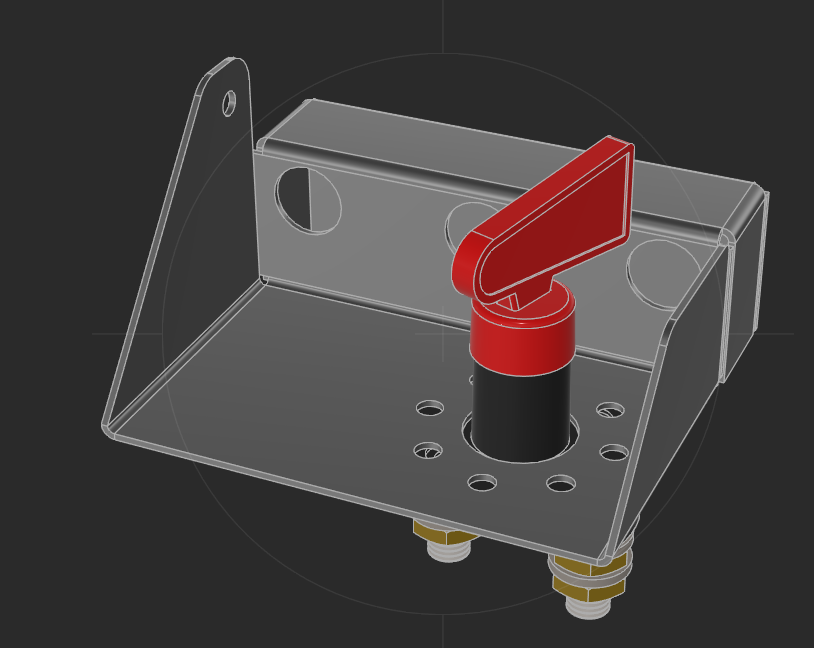
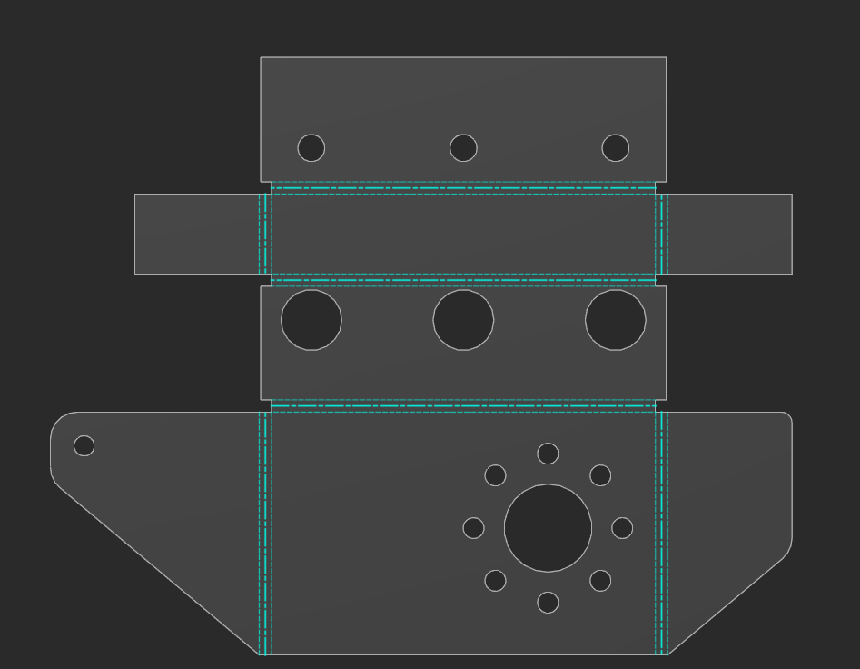

# Support coupe-circuit batterie

Fabrication d'un support tôlé pour fixer le coupe-circuit principal à proximité de la batterie, avec passage de câble vers la tirette habitacle.

---

## Principe

Le coupe-circuit est monté sur une platine en tôle fixée près de la batterie. Un câble relie le levier du coupe-circuit à une tirette dans l'habitacle, permettant de couper le circuit électrique depuis l'intérieur du véhicule (exigence réglementaire raid).

---

## Fabrication du support

- **Matière :** tôle acier 1,6 ou 2 mm
- **Procédé :** découpe à plat puis pliage + soudure des plis

### Vue 3D assemblée

*Support avec coupe-circuit monté — platine pliée, patte de fixation, cosses laiton en bas*

### Vue développée (tôle à plat)

*Patron de découpe à plat — lignes de pliage en pointillés cyan. Face principale (bas) : grand trou coupe-circuit + trous secondaires pour passage gaine + patte de fixation arrondie. Flancs latéraux avec oreilles. Face arrière (haut) : 3 trous de fixation.*

---

## Coupe-circuit

- **Type :** coupe-circuit à clé / levier (type compétition)
- **Montage :** central sur la face principale de la platine
- **Cosses :** 2 cosses laiton en face inférieure

---

## Câble tirette habitacle

- Passage du câble de commande à travers les trous de la platine
- Tirette côté habitacle à définir (emplacement TBD)

---

## Fixation support

- Patte de fixation intégrée à la tôle (forme triangulaire arrondie, trou de fixation sur le côté gauche)
- Fixation sur structure proche batterie — emplacement TBD au montage
