# Remplacement dynamo → alternateur

**Source :** [Forum Amoureux des Peugeot 203-403 — fil « Montage d'un alternateur »](https://www.amoureux203-403.com/forum/viewtopic.php?t=1010)  
**Auteur du retour d'expérience :** kristofer (Provence)  
**Date du fil :** janvier 2011  
**Véhicule concerné :** Peugeot 203 (applicable à la 403, mécanique identique)

---

## Alternateur

- **Marque / type :** Bosch 55 A — ref. **0120 489 193**, 14 V
- **Régulateur :** intégré (module Bosch ref. **1 197 311 008**, 12 V) — supprime le boîtier régulateur externe d'origine
- **Véhicules donneurs compatibles :** Citroën C4 (ancienne génération), Peugeot 205 essence (premiers modèles), Peugeot 504
- **Provenance :** casse automobile (~20 € les deux unités)
- **Révision avant montage :** nettoyage complet, remplacement roulements et charbons

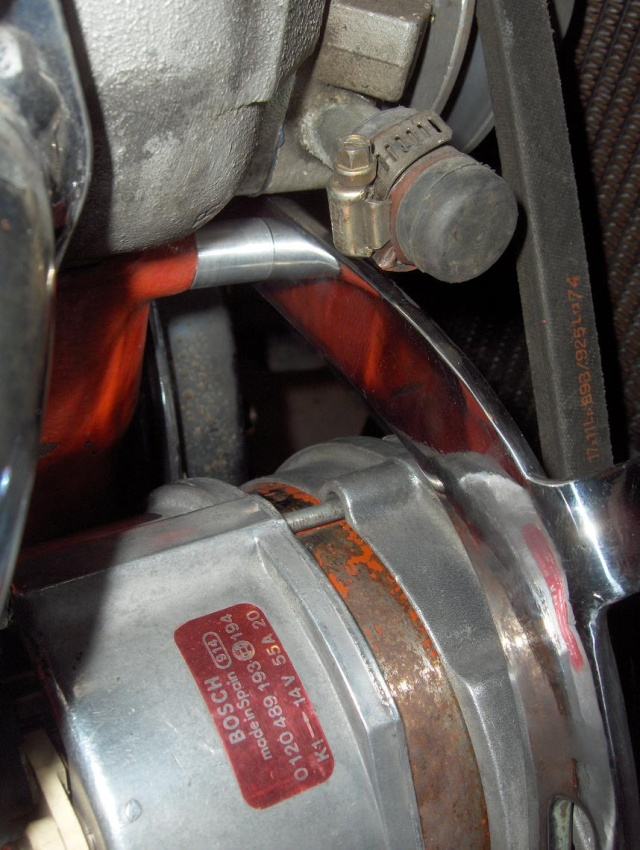
*Alternateur Bosch 55A monté dans le compartiment moteur — étiquette de référence visible*

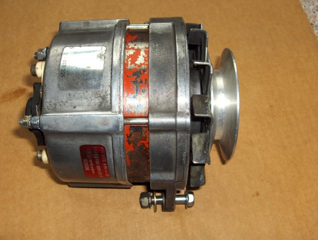
*Alternateur récupéré en casse, poulie aluminium usinée montée — vue côté poulie*

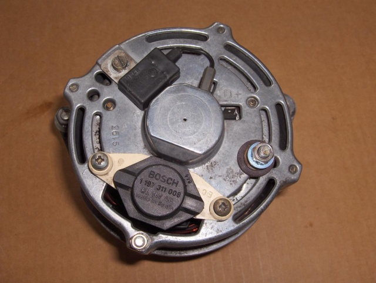
*Face arrière : régulateur intégré Bosch (ref. 1197311008, 12V) et bornes B+ / D+*

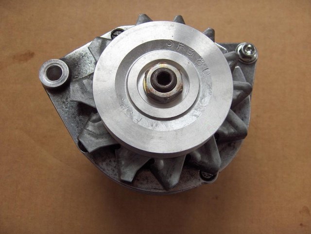
*Vue côté poulie : poulie aluminium DN80 usinée et ventilateur*

---

## Poulie

- **Source :** fournisseur agricole
- **Matière :** aluminium brut
- **Gorge :** trapézoïdale (courroie en V classique)
- **Diamètre retenu : DN 80** — rapport de réduction adapté pour obtenir un bon débit au ralenti
- **Travail de machine :** usinage des flasques et du moyeu pour l'offset correct et l'alignement courroie
- **Courroie :** longueur d'origine de la 203 conservée

---

## Support et fixation

- Bras de tension chromé récupéré et modifié — sert également de masse carrosserie
- Entretoise ajoutée au point de fixation culasse (repère **A.C. P-1113**)
- Vis de fixation dynamo d'origine remplacée par : **vis Ø 12 × 140 mm**

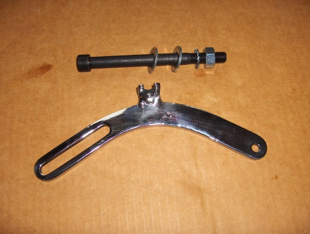
*Bras de tension chromé + vis Ø12×140 avec rondelles et écrou, avant montage*

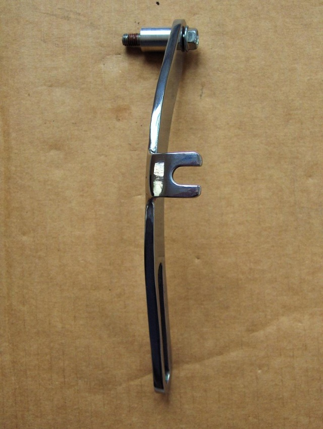
*Bras de tension — lumière de réglage pour mise en tension courroie, vis de fixation supérieure*

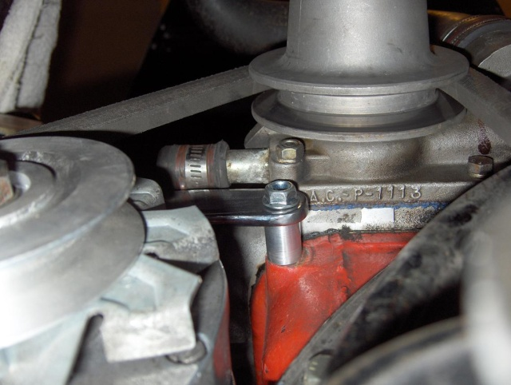
*Point de fixation sur culasse (A.C. P-1113) : entretoise aluminium et vis Ø12×140 en place*

---

## Montage moteur

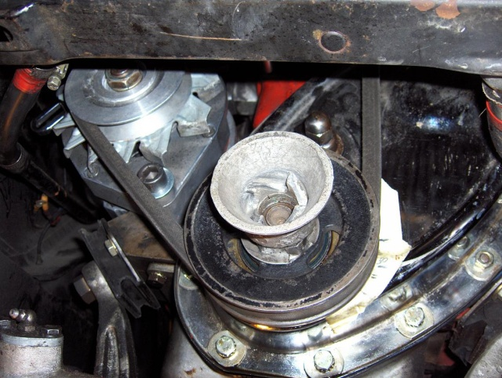
*Alternateur monté — vue d'ensemble avec poulie vilebrequin et courroie en place*

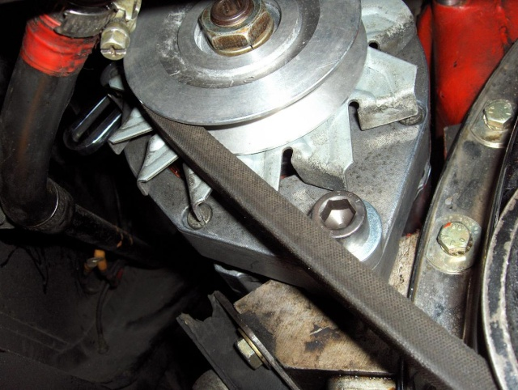
*Gros plan : poulie aluminium DN80 sur alternateur, courroie montée*

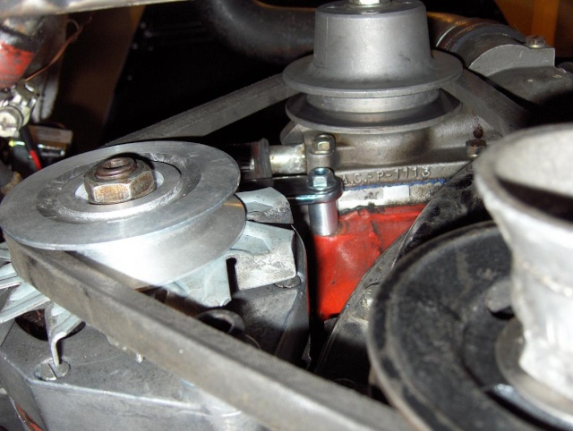
*Vue moteur : alternateur, bras de tension et courroie montés*

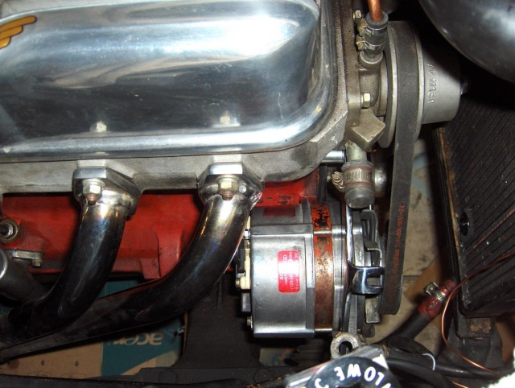
*Vue d'ensemble côté gauche moteur : alternateur monté, câblage en cours*

---

## Électricité

### Remplacement de l'ampèremètre → voltmètre

L'ampèremètre d'origine est incompatible avec un alternateur (mesure impossible, risque de détérioration). Il est remplacé par un **voltmètre Veglia** (ref. **09690659901**, Made in France) d'époque, adapté visuellement au tableau de bord. Une plaque adaptatrice sur mesure est usinée pour recevoir le boîtier du voltmètre dans l'emplacement d'origine de l'ampèremètre.

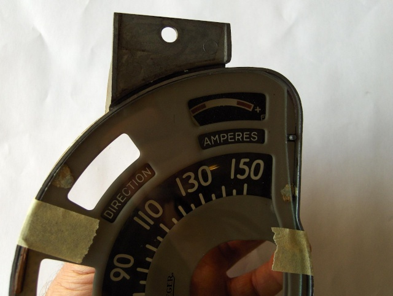
*Combiné de bord d'origine : ampèremètre "AMPERES" (en haut à droite) à déposer*

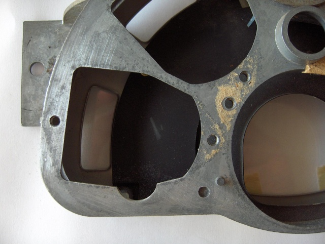
*Platine vue arrière : emplacement ampèremètre vide avant adaptation*

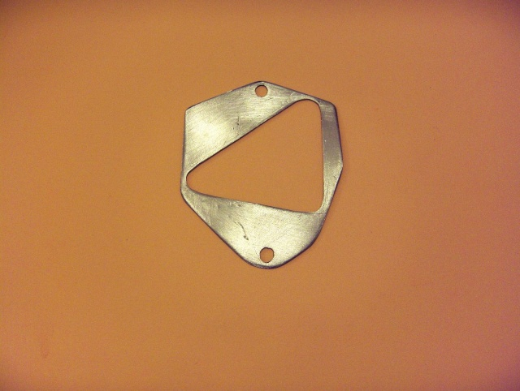
*Plaque adaptatrice aluminium usinée (forme triangulaire) pour recevoir le voltmètre*

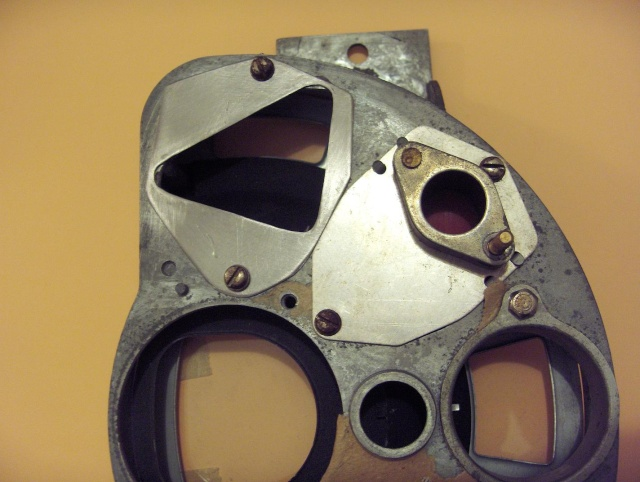
*Platine : adaptateur vissé et support voltmètre en place*

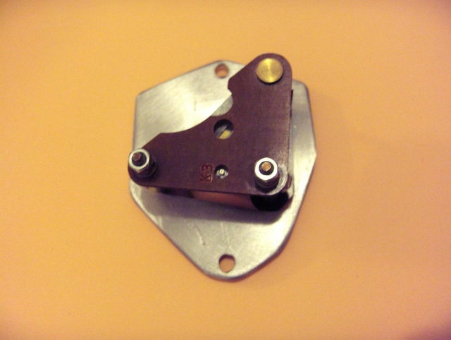
*Voltmètre Veglia (ref. 09690659901) — vue arrière avec bornes de connexion*

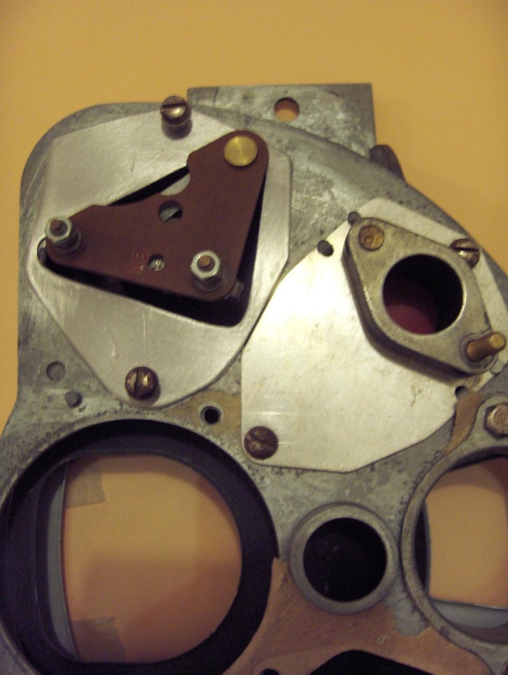
*Platine vue arrière : voltmètre Veglia monté sur la plaque adaptatrice*

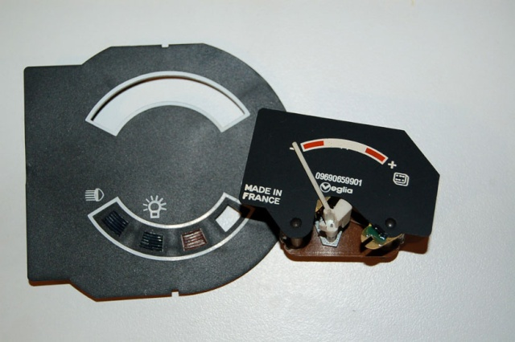
*Voltmètre Veglia positionné devant son emplacement dans le combiné de bord*

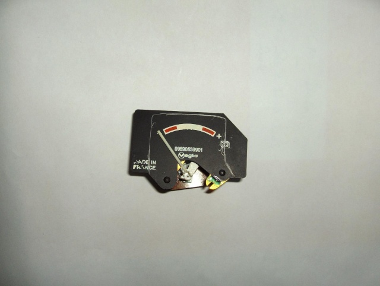
*Voltmètre Veglia (09690659901, Made in France) — face avant*

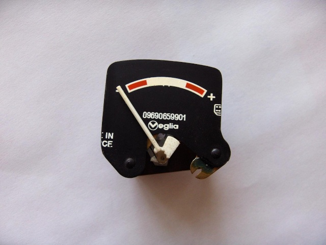
*Gros plan face : graduation et zone rouge de sous-tension*

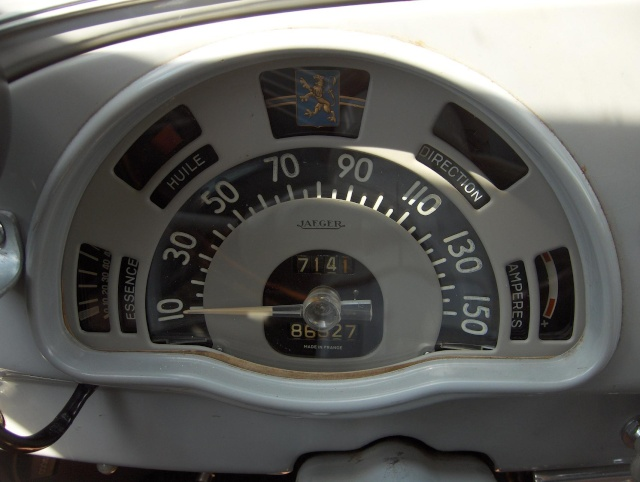
*Résultat final : voltmètre monté à la place de l'ampèremètre dans le combiné de bord*

### Câblage

| Connexion | Détail |
|---|---|
| Sortie principale alternateur (B+) | Câble **10 mm²** vers borne positive batterie (pris depuis le démarreur) |
| Témoin de charge | Relié au contact (position I1) et à la borne **D+** de l'alternateur |
| Positif permanent | Repris sur les points d'origine de l'ampèremètre |
| Masse | Via le bras de tension modifié (contact carrosserie) |

Le boîtier régulateur/coupe-circuit externe d'origine (dynamo) est **déposé** — l'alternateur intègre son propre régulateur.

---

## Réversibilité

L'installation conserve l'ensemble du câblage d'origine. Retour à la dynamo possible **en 30 minutes**.

---

## Notes pour la 403

- Mécanique moteur identique à la 203 — montage directement transposable
- Le rapport d'entraînement DN80 est à vérifier selon le diamètre de la poulie vilebrequin de la 403 (peut différer selon version et année)
- Alternative clé en main : **"fausse dynamo" CiPeRe** (ref. 71430/71431) — alternateur moderne dans un carter identique à la dynamo d'origine, 50 A, ~1 250 € (aucun support à fabriquer)
