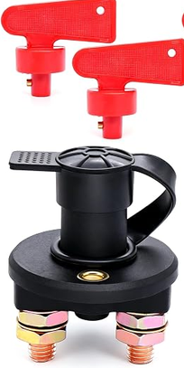
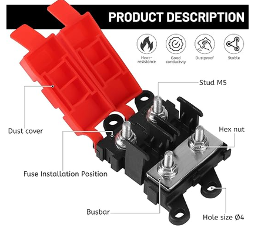

# Modification faisceau électrique

Fiabilisation du câblage d'origine + préparation pour futurs accessoires (hors gadgets raid).

## Matériel

- [x] Coupe-circuit rotatif à clé Master Switch — ref. Amazon B0C36X7LBV (2 clés fournies) ✅ reçu 2026-08-25
  
- [ ] Support coupe-circuit à concevoir/fabriquer (baie moteur)
- [ ] Tirette + câble bowden (commande habitacle → coupe-circuit)
- [ ] Porte-fusible ANL 2 voies bolt-down, couvercle rouge — ref. Amazon B0FLT2RJMW
  
- [ ] 2 × fusible ANL 30 A
- [ ] Porte-fusible ATO 4 voies (habitacle)
- [ ] Fusibles ATO : 1 × 20 ou 25 A / 1 × 5 A / réserves
- [ ] Relais 12 V (type 5 broches, 30/40 A) — klaxon Ooga
- [ ] Klaxon Ooga (puissance max 18 A)
- [ ] Interrupteur momentané (trigger klaxon)
- [ ] Câble automobile multibrin (sections adaptées aux circuits)
- [ ] Cosses à sertir (anneau, fourche — assorties aux sections)
- [ ] Gaine thermorétractable (assortiment diamètres)
- [ ] Gaine tressée ou spiralée
- [ ] Passe-fils caoutchouc (traversées de tôle)
- [ ] Multimètre + pince ampèremétrique
- [ ] Pince à sertir

## Schéma d'origine

```
Batterie (+)
    └─ Démarreur (borne +)
           └─ Câble habitacle (tous circuits d'origine)
```

## Schéma modifié

```
Batterie (+)
    └─ Coupe-circuit à clé (baie moteur, proche batterie)
    │      [actionnable depuis habitacle via tirette + câble bowden]
           └─ Démarreur (borne +)
                  └─ Porte-fusible ANL 2 voies (baie moteur)
                         ├─ Voie 1 — 30 A → câble existant habitacle (circuits d'origine)
                         └─ Voie 2 — 30 A → câble vers habitacle
                                            └─ Porte-fusible ATO 4 voies (habitacle)
                                                   ├─ Voie 1 — 20/25 A → Relais klaxon Ooga
                                                   │                          └─ Klaxon Ooga
                                                   ├─ Voie 2 — 5 A    → Interrupteur momentané (trigger relais)
                                                   ├─ Voie 3 — 20 A    → Platine USB (préparation export)
                                                   │                          [chargeur USB-C 40W + prise allume-cigare 150W max]
                                                   └─ Voie 4 — réserve
```

## Interventions réalisées

| Date | Intervention | Résultat |
|---|---|---|
| | | |

## Photos

<!-- Ajouter dans photos/ au fil des travaux -->
