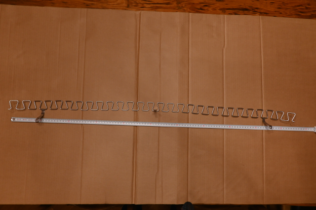
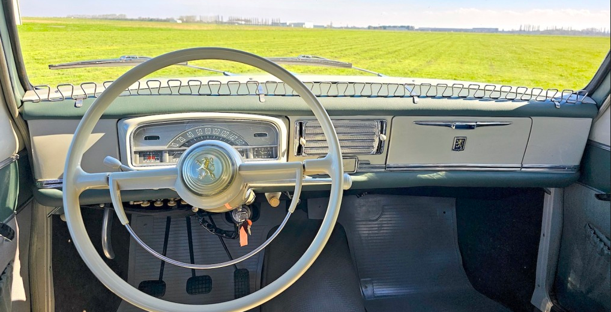

# Fiche technique — Galerie de tableau de bord

Fabrication d'une galerie de tableau de bord sur mesure, dans le style accessoires d'époque.

## Principe

Structure fixée au-dessus ou en bordure du tableau de bord, destinée à accueillir des accessoires vintage : manomètres, montres, compas, lampes de lecture, etc.

## Références

## Notes

*(à compléter — dimensions, matériaux, points de fixation, accessoires retenus)*
