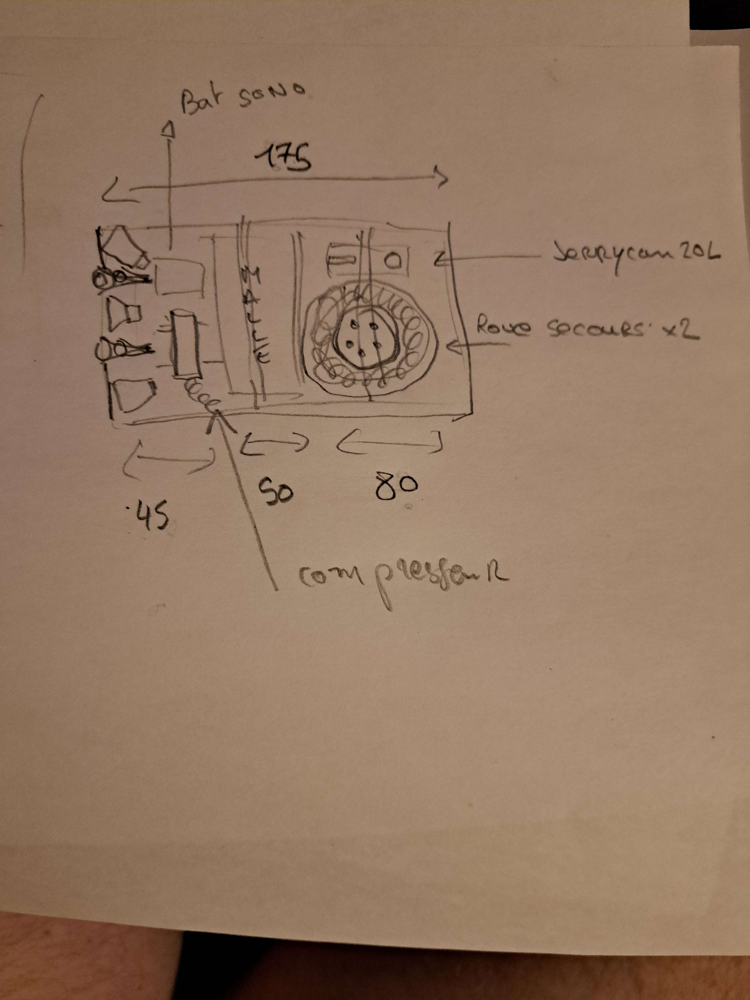
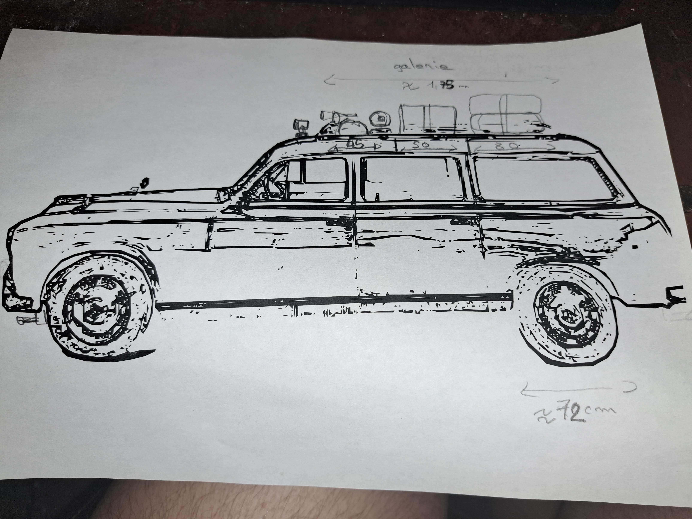

# Galerie de toit — Aménagement

## Dimensions

| Paramètre | Valeur |
|---|---|
| Largeur totale galerie | 175 cm |
| Diamètre max roue de secours | 72 cm |

## Plan d'aménagement

*Vue du dessus — répartition des zones sur 175 cm*

*Vue latérale — galerie sur la 403 break*

## Zones

| Zone | Largeur | Contenu |
|---|---|---|
| Gauche | ~45 cm | Batterie sono + enceintes |
| Milieu | ~50 cm | Compresseur |
| Droite | ~80 cm | Jerrycan 20L + 2 roues de secours |

## Compresseur — VEVOR YD-127-6L

| Paramètre | Valeur |
|---|---|
| Modèle | VEVOR YD-127-6L |
| Alimentation | DC 12V–13.8V |
| Débit max | 6.35 CFM |
| Pression max | 150 PSI |
| Courant max | 45 A |
| Dimensions | 483 × 150 × 390 mm |
| Poids | 12.75 kg |
| Accessoires | câble 6.5ft, tuyau caoutchouc 26ft, 3 adaptateurs, verrou pouce, gonfleur numérique |

Prévu en zone milieu (~50 cm) — largeur 48.3 cm, compatible.

## Structure / fixation

- [ ] Choix du type de galerie (acier / alu soudé, grille universelle…)
- [ ] Points d'ancrage sur le toit de la 403 break
- [ ] Fixation compresseur (anti-vibrations)
- [ ] Fixation jerrycan (platine + sangles)
- [ ] Fixation roues de secours (supports dédiés)
- [ ] Fixation barre sono (supports alu)

## Accès et cheminement câbles

- [ ] Passe-câble étanche pour alimentation compresseur + sono
- [ ] Goulottes de protection le long du montant de pavillon

## Notes

<!-- compléter au fur et à mesure -->
