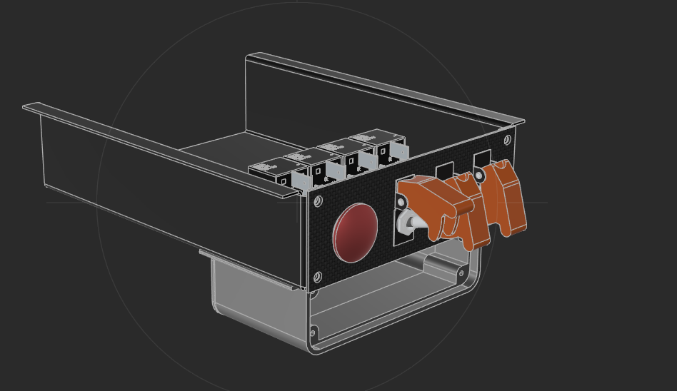
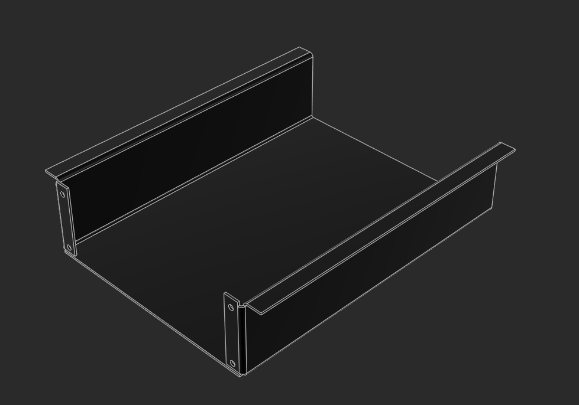
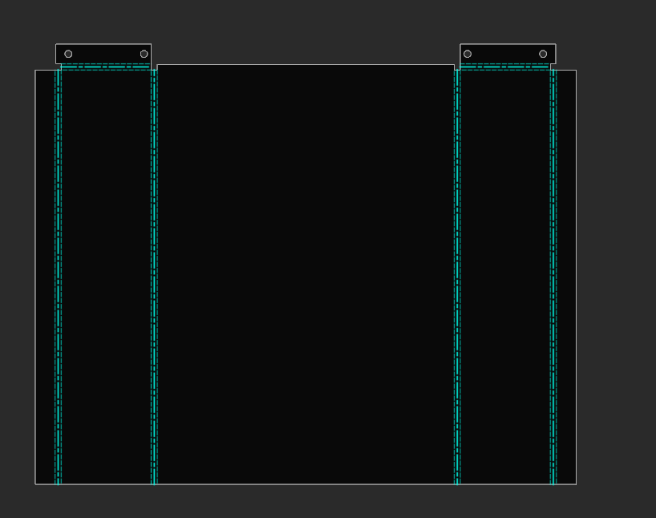
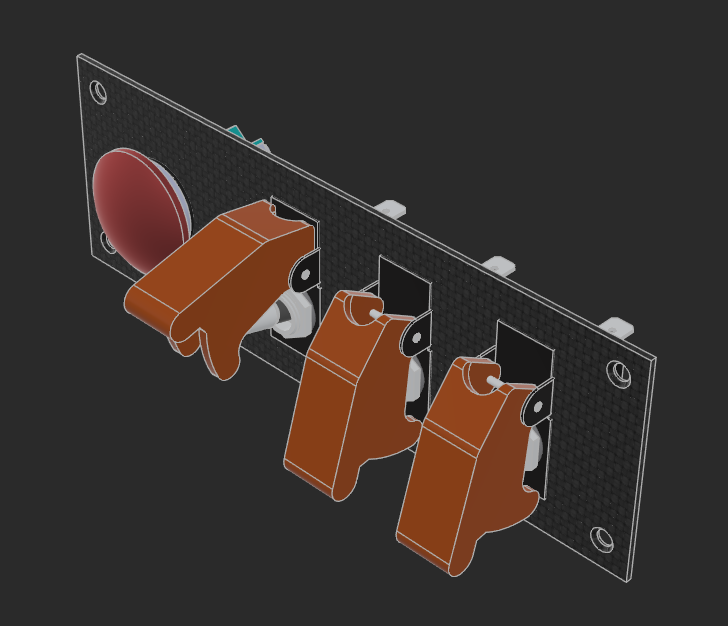

# Tiroir électrique habitacle

Compartiment coulissant dédié à l'électronique habitacle. Fixé dans un support tôlé entre tableau de bord et pare-feu.

> Le tiroir doit être conçu et fabriqué **avant** le support, car ses dimensions déterminent les cotes des glissières.

---

## Tiroir

- **Matière :** tôle acier (épaisseur à définir)
- **Procédé :** découpe + pliage, rebords servant de glissières dans le support

### Illustrations

*Vue 3D complète : tiroir avec façade (bouton poussoir rouge + 3 toggles orange), relais dans le fond, support platine USB visible en dessous*

*Structure tôlée du tiroir seul : flancs servant de glissières dans le support, trous de visserie façade (M4) visibles en bas des flancs*

*Patron de découpe à plat — lignes de pliage cyan sur les flancs, onglets de fixation avec trous en haut de chaque flanc*

### Contenu

- 1 × bouton poussoir (klaxon Ooga)
- 3 × toggle switches (accessoires futurs)
- 4 × relais 12V (un par bouton/toggle)
- 1 × porte-fusible ATO 4 voies (évolutif selon câblage final) — entrée **M5**, sorties **M4**

### Façade

*Façade détachable : panneau finition carbone, bouton poussoir rouge (klaxon) à gauche + 3 toggles orange, 4 trous de visserie M4 aux coins*

- Panneau avant **détachable**, vissé sur le tiroir
- Visserie M4 (type et longueur à choisir)
- Porte les 4 boutons (poussoir + 3 toggles)

### Platine USB (sous le tiroir)

- Fixée sous le tiroir avec son support (voir fiche platine USB — déjà référencée en préparation export)
- Visserie de fixation à déterminer

---

## Support tiroir

Pièce tôlée fabriquée **après** le tiroir (dimensions des glissières calquées sur le tiroir).

- **Matière :** tôle acier (épaisseur à définir)
- **Fixations :** tableau de bord côté habitacle + pare-feu
- **Principe :** rebords repliés formant glissières — le tiroir coulisse dedans et peut être extrait pour accéder aux fusibles et au matériel

---

## Photos

<!-- Ajouter dans photos/ au fil des travaux -->
